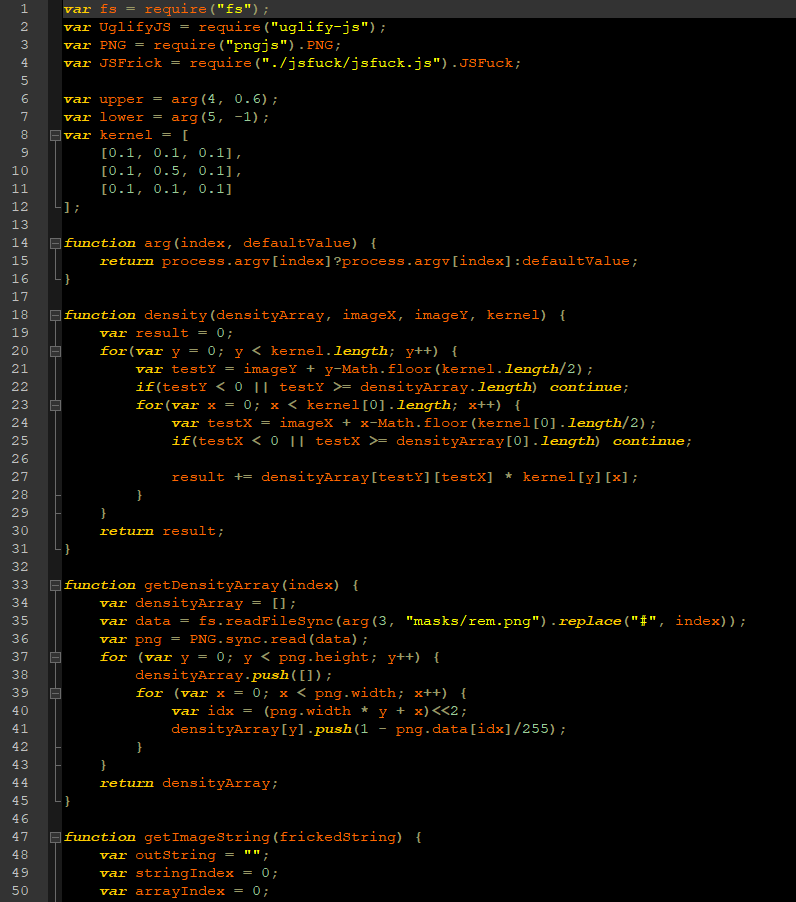

# JSBeautify
JavaScript is *very* ugly. Formatting makes it BEAUTIFUL.

## Usage
1. Clone the repository.
2. Install nodejs and the dependencies (Uglify-js, pngjs).

3. Run the script to beautify your code:
```bash
node beautify.js in.js [mask masks/rem.png] [upper 0.6] [lower -1] [out out.js]
```
4. Enjoy the now beautiful JavaScript on node and in browsers!

## Example
### Before formatting:
File `examples/ugly.js` is an ugly ES5 program, this will never do. How could anyone publish such a monstrosity? Better fix it before anyone sees. Luckily there's a script for that :-).



### After formatting:
What a relief, it looks much better now, finally something I can publish.


## How it works
1. The JavaScript needs to get worse before it can get better: the input is first minified to stop the output being too ridiculously massive.

2. The minified code is then [jsfucked](https://github.com/aemkei/jsfuck).

3. Spaces and new lines are inserted to match the image mask... The code is now BEAUTIFUL!
